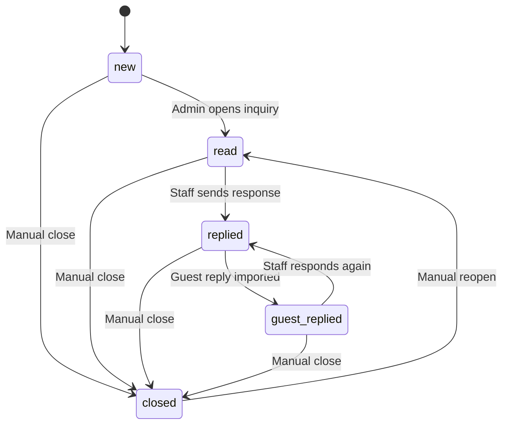
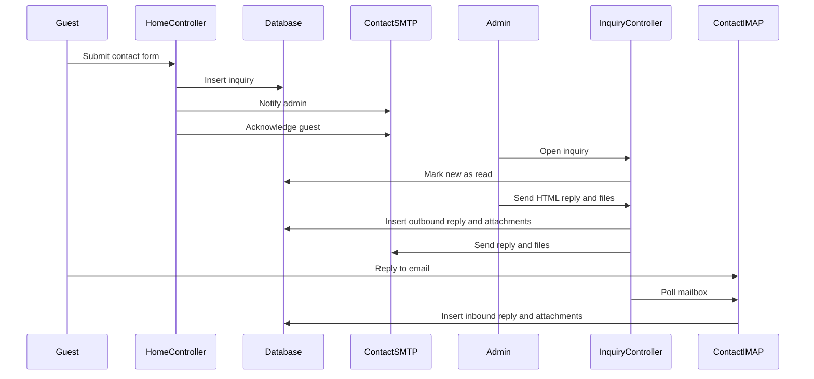

# Inquiries Tool

Complete administrator, developer, deployment, and troubleshooting guide for the BODARE MPC Inquiries tool.

## Contents

1. [Overview](#overview)
2. [Capabilities](#capabilities)
3. [Roles and access](#roles-and-access)
4. [Administrator guide](#administrator-guide)
5. [Guest email workflow](#guest-email-workflow)
6. [Status lifecycle](#status-lifecycle)
7. [Date filters and searching](#date-filters-and-searching)
8. [File attachments](#file-attachments)
9. [Email configuration](#email-configuration)
10. [Inbound email matching](#inbound-email-matching)
11. [Background polling](#background-polling)
12. [Architecture](#architecture)
13. [Controller and URL reference](#controller-and-url-reference)
14. [Database reference](#database-reference)
15. [Validation and security](#validation-and-security)
16. [Installation and deployment](#installation-and-deployment)
17. [Verification checklist](#verification-checklist)
18. [Troubleshooting](#troubleshooting)
19. [Known limitations](#known-limitations)
20. [File reference](#file-reference)

## Overview

The Inquiries tool turns the website Contact Us form into a managed email conversation system.

It provides:

- Public inquiry submission from the homepage and Contact Us page.
- Permanent inquiry storage before email delivery is attempted.
- Administrator notification and guest acknowledgement emails.
- An admin inbox with statuses, date filters, searching, exports, and row navigation.
- HTML-formatted staff replies.
- Guest email reply import through IMAP.
- Multiple outbound and inbound file attachments.
- A sidebar badge that updates without reloading the page.
- Separate Contact Us and Account email sender profiles.

The inquiry record is the conversation root. Every staff or guest reply is stored as a separate `inquiry_reply` record. Files are stored separately and linked to individual replies.

```mermaid
flowchart LR
    GuestForm[Guest submits Contact Us form] --> InquiryRow[Create inquiry record]
    InquiryRow --> AdminEmail[Notify site administrator]
    InquiryRow --> GuestEmail[Send acknowledgement]
    AdminEmail --> AdminInbox[Admin opens Inquiries]
    AdminInbox --> StaffReply[Staff sends reply]
    StaffReply --> ReplyRow[Create outbound reply record]
    ReplyRow --> GuestMailbox[Deliver through contact SMTP]
    GuestMailbox --> GuestReply[Guest replies by email]
    GuestReply --> ContactMailbox[Contact mailbox receives reply]
    ContactMailbox --> ImapImport[IMAP importer matches message]
    ImapImport --> InboundRow[Create inbound reply record]
    InboundRow --> AdminInbox
```



## Capabilities

### Public submission

- Available on both public contact form locations.
- Validates name, email, subject, and message.
- Stores the inquiry before attempting SMTP.
- Records the requester IP address and user agent.
- Sends an administrator notification using the Contact Us mail profile.
- Sends an acknowledgement to the guest.
- Adds an inquiry identifier to the email subject and headers.

### Admin inbox

- Lists inquiries in a searchable DataTable.
- Supports All, New, Guest Replied, Read, Replied, and Closed views.
- Defaults to inquiries created today.
- Supports Today, Last 7 Days, Last 30 Days, and Custom date ranges.
- Exports visible rows through Print, Copy, PDF, Excel, and CSV.
- Opens an inquiry by clicking anywhere on its row.
- Keeps the action menu independent from row navigation.

### Conversation view

- Displays the original inquiry.
- Shows inbound and outbound replies chronologically.
- Distinguishes guest messages from staff messages.
- Supports formatted HTML replies through Trumbowyg.
- Shows whether an outbound email was sent successfully.
- Displays and downloads attachments per message.
- Allows manual status changes.
- Allows manual IMAP mailbox checks.

### Email replies

- Staff replies are sent through the Contact Us SMTP profile.
- Guest email replies are imported through IMAP.
- Message subjects retain `[Inquiry #ID]` for reliable matching.
- The custom `X-BODARE-Inquiry-ID` header provides an additional match key.
- IMAP UID and Message-ID values prevent duplicate imports.

## Roles and access

The Inquiries controller allows authenticated users with these positions:

- Super Admin
- Admin
- Manager
- Staff

The constructor applies both a session-position check and `Coop_access::requireAnyRole()`.

Only Admin and Super Admin users can change email/SMTP settings.

Current access behavior:

- All supported inquiry roles can list, view, reply, update status, download files, check email, and delete inquiries.
- Attachment downloads pass through the authenticated Inquiry controller.
- Public users cannot access the admin inquiry endpoints.

## Administrator guide

### Open the inquiry inbox

1. Sign in to the dashboard.
2. Select **Inquiries** in the left sidebar.
3. The number badge represents inquiries in either `new` or `guest_replied` status.
4. The list initially shows inquiries created today.

### Open an inquiry

Click anywhere on an inquiry row. The three-dot action menu can also be used to choose **View**.

Opening a `new` inquiry automatically changes its status to `read`.

### Read the conversation

The conversation view contains:

- Guest name and email.
- Original subject and message.
- Current status.
- Original submission date.
- Staff and guest replies in chronological order.
- Delivery state for staff replies.
- File attachments linked to the message that contained them.

Guest email replies use the **Received via Email** label. Staff replies use either **Email Sent** or **Email Failed**.

### Send a reply

1. Open an inquiry.
2. Confirm or edit the reply subject.
3. Compose the message in the HTML editor.
4. Optionally select attachments.
5. Select **Send Reply**.

The system:

1. Validates and sanitizes the reply.
2. Validates and stores attachments.
3. Creates the reply record.
4. Sends the HTML email and attachments through the Contact Us SMTP profile.
5. Updates `email_sent`.
6. Changes the inquiry status to `replied`.

If SMTP delivery fails, the reply remains in the conversation with the **Email Failed** label. This preserves the message for auditing and retry-by-copying.

### Check for guest email replies

Select **Check Email Replies** from either:

- The inquiry list, or
- An individual inquiry.

If exactly one new guest message is imported, the system opens that inquiry. If multiple messages are imported, the system returns to the Guest Replied list.

Inbound email is also checked automatically in the background when dashboard polling is active.

### Change an inquiry status

Open an inquiry, select a status, and choose **Update**.

Available statuses:

- New
- Guest Replied
- Read
- Replied
- Closed

### Delete an inquiry

Use the three-dot action menu or the Delete button from the conversation view.

Deleting an inquiry removes:

1. Files stored for all replies.
2. Attachment metadata.
3. Conversation reply records.
4. The inquiry record.

Deletion is permanent. Take a database and file backup when retention is required.

## Guest email workflow

### Initial submission

Public forms submit these fields:

- `name`
- `email`
- `subject`
- `body`
- `redirect_to`

The POST endpoint is:

```text
home/home/contactWithUs
```

Allowed redirect destinations are `home` and `home/contact`.

The inquiry is saved with `status = new` before any email operation. A mail server failure therefore does not lose the inquiry.

### Email messages created

The tool sends two best-effort messages:

1. An administrator notification to `websitebasic.email`.
2. A guest acknowledgement to the submitted guest email address.

Both subjects include:

```text
[Inquiry #123]
```

Both messages also include:

```text
X-BODARE-Inquiry-ID: 123
```

The guest acknowledgement uses the contact mailbox as Reply-To. The administrator notification uses the guest as Reply-To.

### Continuing the conversation

The guest should reply to the acknowledgement email without removing the inquiry tag from the subject. The IMAP importer reads the contact mailbox, identifies the conversation, stores the new message, and sets the inquiry to `guest_replied`.

## Status lifecycle

A typical lifecycle is:



Status changes can also be made manually, so the lifecycle is not strictly enforced.

## Date filters and searching

### Date ranges

The inbox supports:

- **Today** — current date only; this is the default.
- **Last 7 Days** — today plus the previous six days.
- **Last 30 Days** — today plus the previous 29 days.
- **Custom** — user-selected start and end dates.

The list accepts these query parameters:

```text
status=new|guest_replied|read|replied|closed
range=today|7|30|custom
date_from=YYYY-MM-DD
date_to=YYYY-MM-DD
```

Examples:

```text
dashboard/inquiry/allinquiries?range=today
dashboard/inquiry/allinquiries?status=guest_replied&range=7
dashboard/inquiry/allinquiries?range=custom&date_from=2026-07-01&date_to=2026-07-17
```

Status counts use the selected date range. The sidebar badge does not use the date filter.

If the custom start date is later than the end date, the controller swaps them.

### Search

The DataTable search filters the rows already returned by the server. Date and status filtering happen on the server first.

### Exports

Print, Copy, PDF, Excel, and CSV export columns 1–6 and exclude the action column.

## File attachments

Attachments are supported for:

- Staff replies sent from the admin conversation view.
- Guest replies received through email and IMAP.

Public Contact Us forms do not accept attachments.

### Attachment policy

- Maximum files per message: 5
- Maximum size per file: 10 MB
- Maximum combined size per message: 20 MB

Allowed extensions:

- PDF: `.pdf`
- Word: `.doc`, `.docx`
- Excel: `.xls`, `.xlsx`
- Text: `.txt`
- Images: `.jpg`, `.jpeg`, `.png`

The server checks both extension and detected MIME type.

### Storage

Files are stored in:

```text
files/inquiry_attachments/
```

Stored filenames are opaque and include a timestamp plus random bytes. The original filename is retained only as metadata and as the download filename.

Direct web access is blocked by:

- `files/inquiry_attachments/.htaccess`
- `files/inquiry_attachments/index.html`

Downloads must use:

```text
dashboard/inquiry/downloadattachment/{attachmentid}
```

The controller verifies authentication, attachment metadata, inquiry existence, and path confinement before returning file contents.

### Outbound failure behavior

- Validation failure rejects the entire attachment batch.
- A partial storage failure rolls back files and attachment records.
- SMTP failure does not delete the saved reply or attachments.

### Inbound failure behavior

Unsafe, unsupported, empty, excessive, or oversized inbound attachments are skipped. The text reply is still imported.

Inline MIME parts, such as common email signature images, are ignored.

## Email configuration

Open:

```text
Dashboard > Website > Email/SMTP Settings
```

Two profiles are available:

- `contact` — inquiries, Contact Us notifications, acknowledgements, and replies.
- `account` — registration and password reset messages.

The Inquiries tool always uses the `contact` profile.

### SMTP fields

Configure:

- Protocol, normally `smtp`
- SMTP host
- SMTP port
- SMTP username
- SMTP password
- Encryption: SSL, TLS, or none
- Connection timeout
- From email
- From name
- Mail type, normally `html`
- Charset, normally `utf-8`
- Active state

Passwords are encrypted using AES-256-CBC through `Coop_mail`.

The encryption key is defined in:

```text
application/config/smtp_settings.php
```

Do not change this key after saving SMTP passwords. Changing it makes existing encrypted passwords unreadable. If it must change, save each mailbox password again afterward.

### IMAP fields

The Contact Us profile also provides:

- IMAP host
- IMAP port, normally `993`
- IMAP encryption: SSL, TLS, or none
- Enable inbound email fetching

IMAP reuses the Contact Us SMTP username and password.

The current mailbox string uses `novalidate-cert`. Production systems should use a correctly issued mail certificate and may tighten this behavior in `Coop_imap::build_mailbox_string()`.

## Inbound email matching

`Coop_imap::import_inbound_replies()` checks the contact mailbox.

### Search strategy

1. Search for `UNSEEN` messages.
2. If none are found, search messages from the last 14 days.
3. Sort newest first.
4. Process at most 50 messages per run.

### Conversation matching

The importer determines the inquiry in this order:

1. `X-BODARE-Inquiry-ID` header.
2. `[Inquiry #ID]` in the subject.
3. Sender email plus normalized subject.
4. Most recent inquiry from the sender email.

After finding an inquiry, the importer verifies that the sender email matches the email stored on that inquiry.

Subject normalization removes:

- Inquiry tags.
- Re, Fw, and Fwd prefixes.
- The acknowledgement prefix `We received your message:`.

### Deduplication

The importer prevents duplicates with:

- `imap_uid`, stored as `contact:{uid}` and protected by a unique index.
- `message_id`, when supplied by the sender.

After a successful import, the source mailbox message is marked Seen.

### Message body handling

The importer:

1. Prefers a `text/plain` MIME part.
2. Decodes Base64 or quoted-printable transfer encoding.
3. Converts line endings.
4. Removes excessive blank lines.
5. Strips HTML when only an HTML body is found.
6. Removes common quoted-reply sections.
7. Stores the remaining body as an inbound reply.

## Background polling

The dashboard loads `js/inquiry-poll.js` for supported inquiry roles.

Polling behavior:

- Starts when the page is ready.
- Runs every 5 seconds.
- Prevents overlapping requests.
- Updates only `#inquiry-menu-badge`.
- Uses AJAX when jQuery is available and Fetch otherwise.
- Silently ignores transient network failures.

Every sixth poll, approximately every 30 seconds, includes:

```text
?mail=1
```

This asks the server to check IMAP as well as return the badge count.

The poll response is JSON:

```json
{
  "count": 2,
  "imported": 1
}
```

The server uses:

```text
application/cache/inquiry_imap_poll.lock
```

to avoid IMAP checks being triggered too frequently by concurrent dashboard sessions.

## Architecture

The tool follows the existing CodeIgniter HMVC application structure.

### Main layers

- Public controller: accepts and stores contact submissions.
- Dashboard controller: manages admin list, thread, reply, status, delete, download, and polling.
- Mail library: configures SMTP and sends HTML email.
- IMAP library: receives and matches guest replies.
- Helper functions: sanitize HTML and validate/store attachments.
- Views: public forms and admin inbox/thread.
- JavaScript: DataTables behavior and background polling.
- Database: inquiry, reply, attachment, and email settings tables.

### Request flow



## Controller and URL reference

All admin endpoints are handled by:

```text
application/modules/dashboard/controllers/Inquiry.php
```

No custom route entries are required; URLs follow HMVC controller/method routing.

### `index()`

- URL: `dashboard/inquiry`
- Redirects to the list.

### `allinquiries()`

- URL: `dashboard/inquiry/allinquiries`
- Method: GET
- Reads status and date query parameters.
- Loads filtered records and date-aware status counts.

### `view()`

- URL: `dashboard/inquiry/view/{inquiryid}`
- Method: GET
- Loads the inquiry, replies, and grouped attachment records.
- Changes `new` to `read`.

### `reply()`

- URL: `dashboard/inquiry/reply`
- Method: POST
- Validates subject, HTML message, and uploads.
- Stores reply files and metadata.
- Sends through `Coop_mail`.
- Updates delivery state and inquiry status.

### `updatestatus()`

- URL: `dashboard/inquiry/updatestatus`
- Method: POST
- Accepts the inquiry ID and an allowed status.

### `delete()`

- URL: `dashboard/inquiry/delete/{inquiryid}`
- Method: GET
- Removes stored files, attachment rows, replies, and inquiry.

### `downloadattachment()`

- URL: `dashboard/inquiry/downloadattachment/{attachmentid}`
- Method: GET
- Streams an authorized attachment using its original filename.

### `fetchinbound()`

- URL: `dashboard/inquiry/fetchinbound`
- Method: POST
- Imports new guest messages through IMAP.

### `poll()`

- URL: `dashboard/inquiry/poll`
- Method: GET
- Returns the notification count.
- With `mail=1`, may also import inbound messages.

## Database reference

### `inquiry`

Conversation root fields:

- `inquiryid` — primary key.
- `name` — guest name.
- `email` — guest email used for message matching.
- `subject` — original subject.
- `message` — original plain-text message.
- `status` — current workflow status.
- `ip_address` — public submitter IP.
- `user_agent` — public submitter browser agent.
- `cdate` — legacy human-readable date.
- `created_at` — creation timestamp.
- `updated_at` — last workflow update timestamp.

Indexes exist for status and creation time.

### `inquiry_reply`

Conversation message fields:

- `replyid` — primary key.
- `inquiryid` — conversation reference.
- `userid` — staff user for outbound replies; null for inbound.
- `direction` — `outbound` or `inbound`.
- `sender_email` — inbound sender address.
- `sender_name` — inbound sender display name.
- `reply_subject` — full email subject.
- `reply_message` — HTML outbound body or imported inbound text.
- `email_sent` — outbound SMTP result.
- `imap_uid` — mailbox UID namespace key.
- `message_id` — RFC email Message-ID.
- `cdate` — legacy human-readable date.
- `created_at` — message timestamp.

`imap_uid` has a unique index.

### `inquiry_reply_attachment`

Attachment fields:

- `attachmentid` — primary key.
- `replyid` — owning reply.
- `inquiryid` — owning conversation.
- `direction` — inbound or outbound.
- `original_filename` — displayed/downloaded filename.
- `stored_filename` — opaque disk filename.
- `mime_type` — detected content type.
- `file_size` — bytes.
- `created_at` — storage timestamp.

### `email_smtp_settings`

Important fields:

- `profile`
- `protocol`
- `smtp_host`
- `smtp_port`
- `smtp_user`
- `smtp_pass`
- `smtp_crypto`
- `smtp_timeout`
- `from_email`
- `from_name`
- `mailtype`
- `charset`
- `is_active`
- `imap_host`
- `imap_port`
- `imap_crypto`
- `imap_enabled`

## Validation and security

### Public form

- Name is required and limited to 150 characters.
- Email is required, validated, and limited to 255 characters.
- Subject is required and limited to 255 characters.
- Message is required and limited to 5,000 characters.
- Name, email, and subject pass through CodeIgniter XSS cleaning.
- Message HTML is removed with `strip_tags()`.
- Email output is escaped.

### Staff reply

- Subject is required and limited to 255 characters.
- Reply body is required and limited to 10,000 characters.
- HTML passes through `sanitize_inquiry_html()`.
- Supported formatting includes paragraphs, line breaks, emphasis, lists, links, headings, block quotes, spans, and divs.
- Event-handler attributes and `javascript:` links are removed.

### Attachments

- Extension allowlist.
- MIME allowlist.
- Per-file, file-count, and total-message size limits.
- Opaque stored filenames.
- Private directory guard.
- Authenticated download endpoint.
- `basename()` and `realpath()` path confinement.

### Authorization

- Login is required.
- Position allowlist is checked.
- `Coop_access` applies a second role check.
- SMTP configuration is limited to Admin and Super Admin.

### Operational security notes

- Keep the SMTP encryption key secret and stable.
- Keep `files/inquiry_attachments` non-public.
- Ensure the web server honors the deny rule or add an equivalent nginx rule.
- Restrict writable permissions to the web-server account.
- Back up both the database and attachment directory together.
- Consider converting deletion from GET to POST with CSRF protection before exposing the dashboard to untrusted networks.
- Consider replacing the regex-based HTML sanitizer with a full HTML purifier if untrusted staff accounts are possible.

## Installation and deployment

### Prerequisites

- PHP compatible with the application.
- MySQL or MariaDB.
- OpenSSL PHP extension.
- IMAP PHP extension for inbound replies.
- Fileinfo PHP extension recommended for reliable MIME checks.
- Network access to the SMTP and IMAP hosts.
- Writable application cache and attachment directories.

### Apply database scripts

Back up the database first. Apply scripts in this order:

```text
database/inquiry.sql
database/email_smtp_settings.sql
database/email_smtp_profiles.sql
database/inquiry_inbound.sql
database/inquiry_attachments.sql
```

Some scripts use `ALTER TABLE` and are intended to be run once. Check the current schema before rerunning migrations.

Example for MySQL:

```bash
mysql -u USER -p DATABASE < database/inquiry.sql
mysql -u USER -p DATABASE < database/email_smtp_settings.sql
mysql -u USER -p DATABASE < database/email_smtp_profiles.sql
mysql -u USER -p DATABASE < database/inquiry_inbound.sql
mysql -u USER -p DATABASE < database/inquiry_attachments.sql
```

### Enable IMAP in XAMPP

1. Open `C:\xampp\php\php.ini`.
2. Enable:

```ini
extension=imap
```

3. Restart Apache.
4. Verify:

```powershell
C:\xampp\php\php.exe -m
```

Confirm that `imap` appears in the output.

### Directory permissions

The PHP process must be able to write to:

```text
files/inquiry_attachments/
application/cache/
```

The cache directory is required for the IMAP polling lock.

### Configure the Contact Us mailer

1. Sign in as Admin or Super Admin.
2. Open Website > Email/SMTP Settings.
3. Select the Contact Us Mailer profile.
4. Enter SMTP host, port, username, password, crypto, From address, and From name.
5. Enable SMTP.
6. Enter IMAP host, port, and crypto.
7. Enable inbound email fetching.
8. Save.
9. Send a test email.

### Configure the notification recipient

Set the administrative email in the website basic settings. The Contact Us submit handler sends new-inquiry notifications to `websitebasic.email`.

### Production web-server protection

Apache must honor:

```apache
Require all denied
```

inside `files/inquiry_attachments/.htaccess`.

For nginx, add an equivalent deny rule for the directory. Do not expose stored attachment filenames directly.

## Verification checklist

### Public form

- Submit from the homepage.
- Confirm the browser returns to the homepage contact section.
- Submit from the Contact Us page.
- Confirm an `inquiry` row is created.
- Confirm the administrator notification arrives.
- Confirm the guest acknowledgement arrives.
- Confirm both subjects contain the inquiry ID.

### Admin list

- Confirm the default date range is Today.
- Test 7-day, 30-day, and custom ranges.
- Test each status tab.
- Confirm counts follow the selected date range.
- Search by name, email, subject, and status.
- Test row-click navigation.
- Test the three-dot action menu.
- Test each export format.

### Conversation

- Open a New inquiry and confirm it becomes Read.
- Send an HTML reply with bold text, links, and lists.
- Confirm HTML renders correctly in the thread and email.
- Confirm status becomes Replied.
- Test manual status updates.

### Outbound attachments

- Send one allowed attachment.
- Send five allowed attachments under 20 MB combined.
- Reject a sixth attachment.
- Reject a file over 10 MB.
- Reject a message over 20 MB combined.
- Reject an unsupported extension.
- Confirm delivered email files open correctly.
- Confirm thread download links work.

### Inbound replies

- Reply from the guest mailbox while preserving the subject.
- Include an allowed attachment.
- Select Check Email Replies.
- Confirm one inbound reply and attachment are created.
- Run Check Email Replies again and confirm no duplicate is created.
- Confirm status becomes Guest Replied.
- Confirm the sidebar badge updates.

### Failure handling

- Disable SMTP and send a reply.
- Confirm the reply remains stored with Email Failed.
- Disable IMAP and confirm a readable error appears on manual checks.
- Make the attachment directory temporarily unwritable and confirm upload failure is handled.

### Delete and cleanup

- Create an inquiry with inbound and outbound attachments.
- Delete the inquiry.
- Confirm inquiry, replies, and attachment rows are removed.
- Confirm stored files are removed from disk.

## Troubleshooting

### Public form succeeds but no email arrives

The inquiry is intentionally saved before email is attempted.

Check:

- Contact profile `is_active`.
- SMTP host and port.
- SSL/TLS mode.
- SMTP username and password.
- Firewall access.
- `websitebasic.email`.
- Spam or quarantine folders.

### Reply is saved with Email Failed

This indicates the database operation succeeded but SMTP failed.

Use the SMTP test and review:

- Authentication errors such as SMTP 535.
- Host connectivity.
- Port and encryption mismatch.
- Changed encryption key.
- Mail-server attachment size limits.

### Unable to decrypt the SMTP password

The configured encryption key does not match the key used when the password was saved.

Restore the original key or save the mailbox password again through Email/SMTP Settings.

### PHP IMAP extension is not enabled

Enable `extension=imap` in the active PHP configuration and restart Apache. Confirm that the CLI and Apache may use different `php.ini` files.

### IMAP connection failed

Check:

- IMAP host.
- Port, usually 993 for SSL.
- Crypto selection.
- Username and password.
- Mailbox IMAP availability.
- Server firewall.

### Guest reply is not imported

Possible causes:

- Inbound fetching is disabled.
- Sender address differs from the inquiry email.
- Inquiry tag and custom header were removed.
- Message is outside the fallback search window.
- More than 50 newer messages were selected in the current run.
- IMAP UID or Message-ID was already imported.
- Mail is in a folder other than INBOX.

### Guest reply is attached to the wrong inquiry

The fallback matcher may choose the most recent inquiry from the same email when no inquiry tag or matching subject remains.

Ask guests to preserve the subject. For stronger guarantees, remove or narrow the final email-only fallback in `Coop_imap`.

### Inbox looks empty

The default range is Today. Select Last 7 Days, Last 30 Days, or Custom.

Also check the active status tab and DataTable search text.

### Sidebar badge does not update

Check:

- The current role is supported.
- `#inquiry-menu-badge` exists.
- `window.INQUIRY_POLL_URL` is present.
- `js/inquiry-poll.js` loads successfully.
- Browser developer console and Network panel.
- Session authentication has not expired.

### Attachment is rejected

Verify:

- Extension is allowed.
- Detected MIME type is allowed.
- File is not empty.
- File is at most 10 MB.
- Message contains at most five files.
- Combined size is at most 20 MB.

### Attachment download returns 404

Check:

- Attachment metadata exists.
- Inquiry still exists.
- Stored file exists.
- Stored filename matches metadata.
- File remains under `files/inquiry_attachments`.
- PHP has read access.

### Attachment upload cannot save

Check:

- Directory exists.
- PHP has write permission.
- PHP upload limits are high enough:

```ini
upload_max_filesize = 10M
post_max_size = 21M
max_file_uploads = 5
```

`post_max_size` should include request overhead; using more than 21 MB may be appropriate.

### Non-English inquiry labels are blank

New inquiry strings are currently defined in the English dashboard language file. Add matching keys to other language files used by the installation.

## Known limitations

- Public Contact Us forms do not support file attachments.
- The default list shows only today, which may surprise users expecting the complete history.
- The DataTable search is client-side after server date/status filtering.
- Inbound import checks INBOX only.
- IMAP processes at most 50 selected messages per run.
- The final IMAP fallback can match the latest inquiry from the same sender when subject tags are missing.
- Inline images are ignored instead of rendered in the conversation.
- Unsupported inbound attachments are skipped without a per-message admin warning.
- A failed outbound message has no one-click resend action.
- Inquiry deletion currently uses a GET endpoint.
- Staff roles can delete inquiries; there is no action-specific permission.
- The attachment schema uses indexes but no database foreign-key constraints.
- The HTML sanitizer is a lightweight allowlist and regex sanitizer, not a full standards-based purifier.
- Polling errors are intentionally silent in the browser.
- New inquiry translations are incomplete outside English.

## File reference

### Public submission

```text
application/modules/home/controllers/Home.php
application/modules/home/views/contact/contact.php
application/modules/home/views/index.php
application/modules/home/views/index2.php
```

### Admin inquiry module

```text
application/modules/dashboard/controllers/Inquiry.php
application/modules/dashboard/views/Inquiry/allinquiries.php
application/modules/dashboard/views/Inquiry/view.php
application/modules/dashboard/views/Dashboard/sidebar_nav.php
application/modules/dashboard/views/Dashboard/footer.php
application/modules/dashboard/views/Dashboard/footer2.php
```

### Mail, IMAP, access, and helpers

```text
application/libraries/Coop_mail.php
application/libraries/Coop_imap.php
application/libraries/Coop_access.php
application/helpers/chms_helper.php
application/config/smtp_settings.php
```

### Email settings

```text
application/modules/dashboard/controllers/Website.php
application/modules/dashboard/views/Website/emailsettings.php
```

### JavaScript

```text
js/inquiry-poll.js
js/iniDatatables.js
```

### Database scripts

```text
database/inquiry.sql
database/email_smtp_settings.sql
database/email_smtp_profiles.sql
database/inquiry_inbound.sql
database/inquiry_attachments.sql
```

### Attachment storage

```text
files/inquiry_attachments/.htaccess
files/inquiry_attachments/index.html
```

### Language

```text
application/language/english/dashboard_lang.php
```

## Maintenance guidance

When modifying the Inquiries tool:

1. Keep inquiry IDs in both subject tags and custom headers.
2. Preserve the rule that inquiries are stored before SMTP is attempted.
3. Keep attachment storage outside direct public access.
4. Apply the same attachment policy to inbound and outbound files.
5. Preserve IMAP UID and Message-ID deduplication.
6. Test polling with multiple simultaneous dashboard sessions.
7. Update this guide whenever statuses, limits, routes, schema, or mail settings change.

